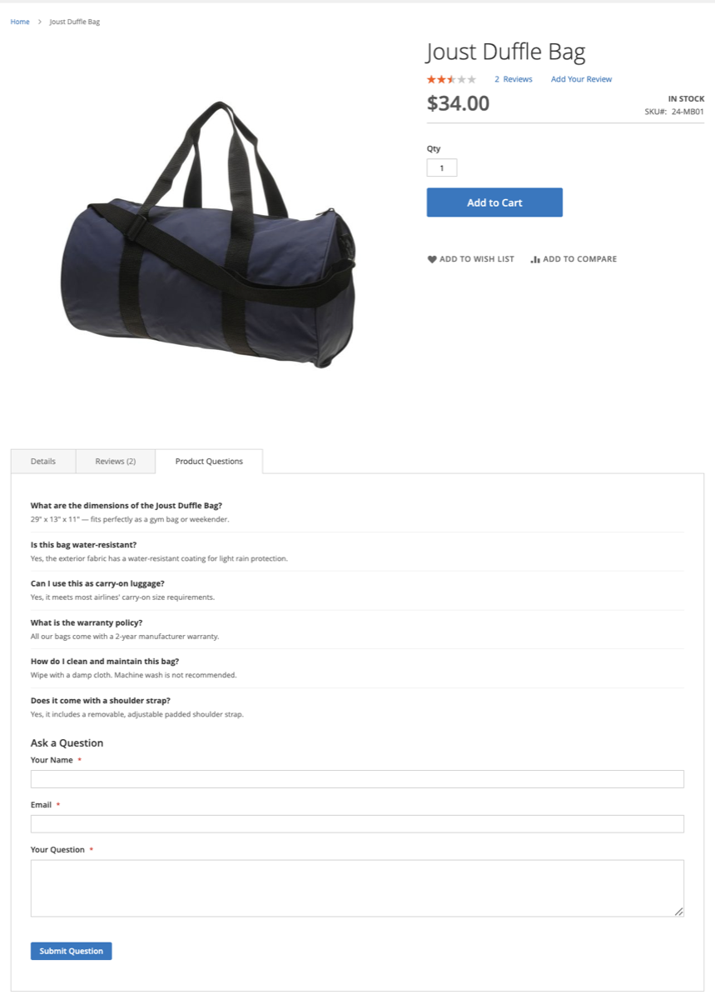
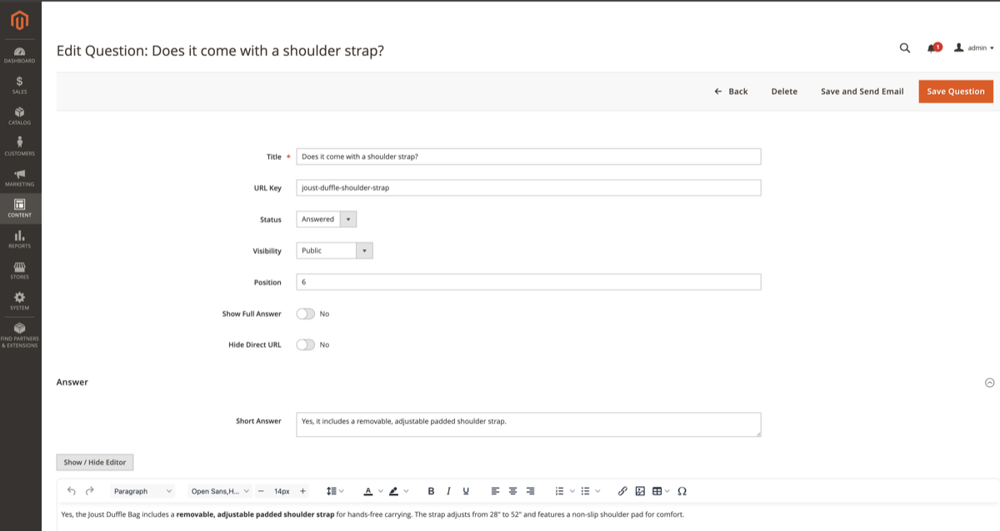
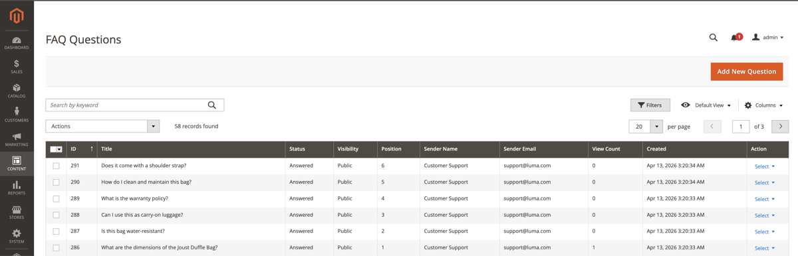

# Magendoo FAQ & Product Questions Module for Magento 2

[](https://business.adobe.com/products/magento/magento-commerce.html)
[](https://php.net)
[](https://opensource.org/licenses/MIT)

A FAQ and Product Questions management system for Magento 2: SEO-friendly FAQ pages, a
product-page Q&A tab with an ask-a-question form, moderation workflow, ratings, search with
analytics, CMS widgets, CSV import/export and a REST API.

## Screenshots

### Product Page — FAQ tab with questions and "Ask a Question" form



### Admin — Question editor with WYSIWYG answer, status workflow, and SEO fields



### Admin — FAQ Questions grid with filtering, mass actions, and status management



## Features

- **Hierarchical FAQ organization** — categories, tags, and product associations
- **Search with analytics** — storefront FAQ search plus an admin Search Terms report
- **Customer engagement** — helpfulness voting (Yes/No or thumbs up/down) or a 1–5 star rating
- **Product page integration** — a "Product Questions" tab with an ask-a-question form
- **REST API** — 24 endpoints; anonymous storefront routes return a privacy-safe projection
- **Moderation workflow** — Pending → Answered / Rejected, with optional email notifications
- **Compliance** — GDPR consent recording (timestamp + wording snapshot), native reCAPTCHA support
- **SEO** — clean URLs with URL rewrites, FAQPage JSON-LD, sitemap integration, canonical links,
  hreflang tags, per-entity robots meta
- **Multi-store** — per-store-view assignment for categories and questions; customer-group
  restrictions for B2B/B2C segmentation

A merchant-oriented walkthrough lives in [docs/user-guide.md](docs/user-guide.md).

## Requirements

| Requirement | Version |
|-------------|---------|
| Magento Open Source / Adobe Commerce | 2.4.x (`magento/framework` >= 103.0.0) |
| PHP | 8.1+ |

Developed and tested against Magento Open Source 2.4.9 on PHP 8.4. Depends on the
`Magento_Sitemap`, `Magento_Widget` and reCAPTCHA modules, all declared in `composer.json`
(they ship with every standard Magento installation).

## Installation

### Composer

```bash
composer require magendoo/module-faq
bin/magento module:enable Magendoo_Faq
bin/magento setup:upgrade
bin/magento cache:flush
bin/magento magendoo:faq:reindex
```

### Manual

```bash
cp -r Magendoo/Faq app/code/Magendoo/
bin/magento module:enable Magendoo_Faq
bin/magento setup:upgrade
bin/magento cache:flush
bin/magento magendoo:faq:reindex
```

In production mode also run `bin/magento setup:di:compile` and
`bin/magento setup:static-content:deploy`.

### Post-installation setup

1. **Configure the module:** *Stores → Configuration → Magendoo Extensions → FAQ*
2. **Set admin permissions:** *System → Permissions → User Roles* — the FAQ resources appear
   under *Content → FAQ*
3. **Enable reCAPTCHA (recommended):** *Stores → Configuration → Security → Google reCAPTCHA
   Storefront* — set keys, then choose a type for **Enable for FAQ Ask a Question Form**
4. **Create content:** *Content → FAQ → FAQ Categories* and *Content → FAQ → FAQ Questions*

### Uninstallation

The module does **not** ship a `Setup/Uninstall` class, and Magento does not process a disabled
module's schema, so neither `module:disable` nor `composer remove` removes any data. To remove
the module completely:

```bash
bin/magento module:disable Magendoo_Faq
composer remove magendoo/module-faq   # or delete app/code/Magendoo/Faq
bin/magento setup:upgrade
bin/magento cache:flush
```

Then, only if you also want to delete all FAQ data, drop the tables and rows manually
(back up first):

```sql
DROP TABLE IF EXISTS magendoo_faq_question_tag, magendoo_faq_rating,
  magendoo_faq_question_customer_group, magendoo_faq_question_product,
  magendoo_faq_question_category, magendoo_faq_question_store,
  magendoo_faq_category_customer_group, magendoo_faq_category_store,
  magendoo_faq_search_log, magendoo_faq_question, magendoo_faq_category,
  magendoo_faq_tag;
DELETE FROM core_config_data WHERE path LIKE 'magendoo_faq/%';
DELETE FROM url_rewrite WHERE entity_type IN ('faq-category', 'faq-question');
```

---

## Configuration Reference

All settings live under *Stores → Configuration → Magendoo Extensions → FAQ* and can be set per
store view. Defaults below come from `etc/config.xml`; fields without an entry there start
empty/off.

### `magendoo_faq/general`
| Field | Default | Description |
|-------|---------|-------------|
| `enabled` | 1 | Module on/off |
| `title` | `FAQ` | FAQ landing page title |
| `url_prefix` | `faq` | URL segment for all FAQ pages |
| `allow_guest_questions` | 1 | Allow guests to use the storefront ask form |

### `magendoo_faq/navigation`
| Field | Default | Description |
|-------|---------|-------------|
| `show_breadcrumbs` | 1 | Breadcrumb display on FAQ pages |
| `sort_categories_by` | `position` | `position`, `name` or `most_viewed` |
| `sort_questions_by` | `position` | `position`, `name` or `most_viewed` |
| `answer_length_limit` | 250 | Character limit for answer previews in listings |
| `show_search_box` | 1 | Search box on FAQ pages |
| `no_results_text` | *(empty)* | Message when a search finds nothing |
| `questions_per_category_page` | 10 | Pagination on category pages |
| `questions_per_search_page` | 10 | Pagination on search results |
| `short_answer_behavior` | `short_answer` | Listing preview source: `short_answer` or `cut_full_answer` (truncated full answer) |
| `tags_limit` | 20 | Maximum tags in the tag cloud (0 = no limit) |

### `magendoo_faq/product_page`
| Field | Default | Description |
|-------|---------|-------------|
| `enabled` | 1 | Show the questions tab on product pages |
| `tab_name` | `Product Questions` | Tab label; `{count}` is replaced with the question count |
| `tab_position` | 40 | Tab sort order |
| `show_ask_button` | 1 | Show the ask-a-question form in the tab |
| `questions_limit` | 10 | Maximum questions shown in the tab |

### `magendoo_faq/rating`
| Field | Default | Description |
|-------|---------|-------------|
| `enabled` | 1 | Rating widget on question pages |
| `type` | `yes_no` | `yes_no`, `voting` (thumbs up/down) or `average_rating` (1–5 stars) |
| `allow_guest_rating` | 1 | Allow guests to vote; when off, voting requires login |

### `magendoo_faq/social`
| Field | Default | Description |
|-------|---------|-------------|
| `enabled` | 0 | Social share buttons on question pages |
| `networks` | *(empty)* | Any of Facebook, Twitter, LinkedIn, Pinterest, Email |

### `magendoo_faq/seo`
| Field | Default | Description |
|-------|---------|-------------|
| `url_suffix_enabled` | 0 | Append a suffix to FAQ URLs |
| `url_suffix` | `.html` | The suffix (when enabled) |
| `remove_trailing_slash` | 0 | Redirect trailing-slash URLs to the canonical form |
| `use_canonical` | 0 | Emit a `<link rel="canonical">` on FAQ pages (per-entity override available) |
| `structured_data_enabled` | 1 | FAQPage JSON-LD on category and question pages |
| `robots_search_results` | `NOINDEX,FOLLOW` | Robots meta for the search results page |
| `add_to_sitemap` | 1 | Include FAQ pages in the XML sitemap |
| `hreflang_enabled` | 0 | Hreflang alternate links for multi-store setups |
| `sitemap_frequency` | *(empty — falls back to `weekly`)* | Sitemap change frequency |
| `sitemap_priority` | *(empty — falls back to `0.5`)* | Sitemap priority |

### `magendoo_faq/user_notifications`
| Field | Default | Description |
|-------|---------|-------------|
| `enabled` | 0 | Email the asker when their question is answered |
| `email_sender` | `general` | Sender identity |
| `email_template` | `magendoo_faq_user_notifications_email_template` | Template |

### `magendoo_faq/admin_notifications`
| Field | Default | Description |
|-------|---------|-------------|
| `enabled` | 0 | Email the store owner when a new question is submitted |
| `send_to` | `admin@example.com` | Comma-separated recipient addresses |
| `email_template` | `magendoo_faq_admin_notifications_email_template` | Template |

### `magendoo_faq/gdpr`
| Field | Default | Description |
|-------|---------|-------------|
| `enabled` | 0 | Require a consent checkbox on the ask form |
| `consent_text` | "I agree that my name and email address will be stored…" | Checkbox label. When consent is given, the timestamp and the wording shown are stored on the question |

### reCAPTCHA

The ask form registers with Magento's native reCAPTCHA framework as
**FAQ Ask a Question Form** (`recaptcha_frontend/type_for/magendoo_faq_question_submit`) —
configure it under *Stores → Configuration → Security → Google reCAPTCHA Storefront*.

---

## Storefront URLs

Implemented by a custom router (`Magento\Framework\App\RouterInterface`):

```
/faq/                                    → FAQ home (category listing + search)
/faq/{category-url-key}                  → Category page
/faq/{category-url-key}/{question-key}   → Question page (membership is verified;
                                           mismatched pairs redirect to the canonical URL)
/faq/{question-url-key}                  → Question page (via URL rewrite)
/faq/tag/{tag-url-key}                   → Tag page
/faq/search?q=keyword                    → Search results
/faq/question/suggest?q=keyword          → AJAX autocomplete (JSON)
```

- Configurable URL prefix per store view; optional suffix.
- Suffixed/unsuffixed and trailing-slash variants redirect to the canonical form
  (trailing-slash redirect gated by `seo/remove_trailing_slash`).
- URL rewrites are generated on save, cleaned up on delete/unpublish, and validated for
  uniqueness (`url_key` is unique at the database level; collisions produce an actionable
  error naming the conflicting path).
- `bin/magento magendoo:faq:reindex` purges and regenerates all FAQ rewrites.

## CLI Commands

```bash
# Purge and regenerate FAQ URL rewrites for all categories and questions
bin/magento magendoo:faq:reindex

# Export questions or categories to CSV (default file: var/export/faq-{entity}.csv)
bin/magento magendoo:faq:export -e questions -f var/export/faq-questions.csv
bin/magento magendoo:faq:export -e categories

# Import questions or categories from CSV
bin/magento magendoo:faq:import -e questions -f var/export/faq-questions.csv
bin/magento magendoo:faq:import -e categories -f var/export/faq-categories.csv
```

Export includes the relation columns (`store_ids`, `category_ids`, `product_ids`, `tags`,
`customer_group_ids`) and defuses spreadsheet formula injection. Import updates rows whose
`question_id`/`category_id` matches an existing record, creates rows with an empty id column,
and skips (with a report) rows whose id does not exist.

## REST API

24 routes in `etc/webapi.xml`. **Auth** column: *admin* = admin/integration token with the named
ACL resource; *customer* = a logged-in customer token; *anonymous* = no token required.

| Endpoint | Method | Auth | Description |
|----------|--------|------|-------------|
| `/V1/faq/categories` | GET | admin (`Magendoo_Faq::category`) | List categories (SearchCriteria) |
| `/V1/faq/categories/:id` | GET | admin (`Magendoo_Faq::category`) | Get category |
| `/V1/faq/categories` | POST | admin (`Magendoo_Faq::category_edit`) | Create category |
| `/V1/faq/categories/:id` | PUT | admin (`Magendoo_Faq::category_edit`) | Update category |
| `/V1/faq/categories/:id` | DELETE | admin (`Magendoo_Faq::category_delete`) | Delete category |
| `/V1/faq/questions` | GET | admin (`Magendoo_Faq::question`) | List questions (SearchCriteria) |
| `/V1/faq/questions/:id` | GET | admin (`Magendoo_Faq::question`) | Get question (full object) |
| `/V1/faq/questions` | POST | admin (`Magendoo_Faq::question_edit`) | Create question |
| `/V1/faq/questions/:id` | PUT | admin (`Magendoo_Faq::question_edit`) | Update question |
| `/V1/faq/questions/:id` | DELETE | admin (`Magendoo_Faq::question_delete`) | Delete question |
| `/V1/faq/questions/submit` | POST | **customer** | Submit a question (see note below) |
| `/V1/faq/questions/:id/rate` | POST | anonymous | Vote: `positive`/`negative`, or `"1"`–`"5"` in star mode |
| `/V1/faq/products/:id/questions` | GET | anonymous | Product questions (public projection) |
| `/V1/faq/categories/:id/questions` | GET | anonymous | Category questions (public projection) |
| `/V1/faq/questions/search` | GET | anonymous | Full-text search (public projection) |
| `/V1/faq/categories/url-key/:key/store/:id` | GET | anonymous | Category lookup by URL key |
| `/V1/faq/questions/url-key/:key/store/:id` | GET | anonymous | Question lookup by URL key (public projection; 404 for non-public questions) |
| `/V1/faq/questions/:id/notify` | POST | admin (`Magendoo_Faq::question_edit`) | Send answer notification email |
| `/V1/faq/questions/:id/view` | POST | anonymous | Increment view count |
| `/V1/faq/tags` | GET | admin (`Magendoo_Faq::question`) | List tags (SearchCriteria) |
| `/V1/faq/tags/:id` | GET | admin (`Magendoo_Faq::question`) | Get tag |
| `/V1/faq/tags` | POST | admin (`Magendoo_Faq::question_edit`) | Create tag |
| `/V1/faq/tags/:id` | PUT | admin (`Magendoo_Faq::question_edit`) | Update tag |
| `/V1/faq/tags/:id` | DELETE | admin (`Magendoo_Faq::question_delete`) | Delete tag |

Notes:

- **Anonymous routes return a public projection** (`PublicQuestionInterface`): title, url_key,
  answers, position, rating counters, view count and SEO fields. They never include
  `sender_name`, `sender_email`, `customer_id`, `status` or `visibility`.
- **`/V1/faq/questions/submit` requires an authenticated customer.** The storefront form is
  protected by reCAPTCHA through a frontend predispatch observer — an event REST never
  dispatches — so an anonymous REST route would bypass the captcha entirely. Guests submit
  through the storefront form. The submit service enforces the same rules on both entry
  points: guest permission, e-mail validation, GDPR consent, slug sanitisation.
- Rating identity (customer id / IP) is resolved server-side and cannot be supplied by the
  caller.

## For Developers

### Service contracts

```
Api/
├── CategoryRepositoryInterface      # Category CRUD + getByUrlKey()
├── QuestionRepositoryInterface      # Question CRUD + getByUrlKey() (ACL-protected, full object)
├── QuestionManagementInterface      # submit, rate, search, product/category listings,
│                                    # getQuestionByUrlKey() (public projection), notify, views
└── TagRepositoryInterface           # Tag CRUD
```

Repositories support the `SearchCriteria` pattern. Storefront-safe reads go through
`QuestionManagementInterface` and return `Api\Data\PublicQuestionInterface`.

### Database schema (12 tables)

- `magendoo_faq_category`, `magendoo_faq_question`, `magendoo_faq_tag` — entities
  (questions carry SEO fields, rating counters, view count and the GDPR consent record:
  `consent_given_at` + `consent_text` snapshot)
- `magendoo_faq_category_store`, `magendoo_faq_question_store` — store assignment
- `magendoo_faq_category_customer_group`, `magendoo_faq_question_customer_group` — group restrictions
- `magendoo_faq_question_category`, `magendoo_faq_question_product`, `magendoo_faq_question_tag` — M:N relations
- `magendoo_faq_rating` — individual votes (dedup by customer id / IP, server-resolved)
- `magendoo_faq_search_log` — one row per executed search

`url_key` is unique on both the category and question tables.

### Frontend

Layout handles: `faq_index_index`, `faq_category_view`, `faq_question_view`,
`faq_question_search`, `faq_tag_view`, plus `catalog_product_view` for the product tab.

RequireJS components: `faqAskForm`, `faqRating`, `faqAutocomplete`, `faqTabDeeplink`.

All storefront blocks implement `IdentityInterface`, so saving, deleting or re-publishing FAQ
content invalidates the affected full-page-cache entries automatically. The search results
page is deliberately non-cacheable so the search log sees repeat searches.

### Admin

Menu: **Content → FAQ** (FAQ Categories, FAQ Questions, FAQ Search Terms).

UI components: `faq_category_listing`, `faq_category_form`, `faq_question_listing`,
`faq_question_form`, `faq_searchlog_listing`. Mass actions: delete and change-status on both
grids, plus change-visibility for questions.

ACL (`etc/acl.xml`):

```
Magendoo_Faq::faq                       # Content → FAQ menu
├── Magendoo_Faq::category              # Manage Categories (grid access)
│   ├── Magendoo_Faq::category_view
│   ├── Magendoo_Faq::category_edit
│   └── Magendoo_Faq::category_delete
├── Magendoo_Faq::question              # Manage Questions (grid access)
│   ├── Magendoo_Faq::question_view
│   ├── Magendoo_Faq::question_edit
│   ├── Magendoo_Faq::question_delete
│   └── Magendoo_Faq::question_approve
└── Magendoo_Faq::search_log            # Search Terms Report
Magendoo_Faq::config                    # System configuration section (under Stores)
```

### CMS widgets

| Widget | Description |
|--------|-------------|
| **FAQ Questions List** (`magendoo_faq_questions_list`) | Questions, optionally filtered by category; list or accordion template |
| **FAQ Categories List** (`magendoo_faq_categories_list`) | Category links with optional question counts |
| **FAQ Search Box** (`magendoo_faq_search_box`) | Search form with configurable placeholder |

### SEO implementation

- **JSON-LD**: FAQPage schema on category and question pages, encoded with
  `JSON_HEX_TAG|JSON_HEX_AMP|JSON_HEX_APOS|JSON_HEX_QUOT` so user-supplied titles cannot break
  out of the script block.
- **Sitemap**: two `Magento\Sitemap\Model\ItemProvider\ItemProviderInterface` providers
  (categories + questions), honouring per-entity `exclude_sitemap`.
- **Canonical**: `Block\Faq\Canonical` emits `<link rel="canonical">` on the FAQ home,
  category, question and tag pages when `seo/use_canonical` is enabled; a per-entity
  `canonical_url` field overrides the computed URL.
- **Robots**: per-entity noindex/nofollow, and a configurable robots meta on search results.
- **Hreflang**: alternate links per assigned store when `seo/hreflang_enabled` is on.

### Extending

```xml
<!-- app/code/Vendor/Module/etc/di.xml -->
<type name="Magendoo\Faq\Api\QuestionManagementInterface">
    <plugin name="vendor_custom_question_logic"
            type="Vendor\Module\Plugin\QuestionManagementPlugin"/>
</type>
```

All service contracts are interfaces resolved through DI preferences, so they can be plugged
or overridden the standard Magento way.

### Tests and quality gates

- 85 PHPUnit unit tests (`Test/Unit`, PHPUnit 12): `composer test` or
  `vendor/bin/phpunit -c phpunit.xml.dist`
- PHPStan (level in `phpstan.neon.dist`, pre-existing findings recorded in
  `phpstan-baseline.neon`): `composer analyse`
- phpcs with the Magento2 standard: `composer cs`
- CI runs all three on PHP 8.1–8.4.

## Known limitations

Stated plainly so you don't have to discover them:

- The **"Show Full Answer"** and **"Hide Direct URL"** checkboxes on the question form are
  stored but not yet consumed by any storefront code — they currently have no effect.
- The Search Terms report logs **one row per executed search**; the *Hits* column is always 1.
  Sort by *Search Query* to gauge frequency.
- Only an `en_US` translation ships (`i18n/en_US.csv`, all 269 phrases).
- Anonymous REST submission is intentionally disabled (see the REST notes above).

## FAQ

**Q: Can customers submit questions without an account?**

Yes — through the storefront form, when `magendoo_faq/general/allow_guest_questions` is on.
Enable reCAPTCHA for the form to keep bots out. The REST submit route, by contrast, requires a
logged-in customer token.

**Q: Can I migrate FAQs from another platform?**

Yes, via `bin/magento magendoo:faq:import` with a CSV whose header row matches the database
column names (run an export first to get a template), or via the admin REST API.

**Q: Can I restrict FAQs to specific customer groups?**

Yes. Both categories and questions have a Customer Groups multiselect; an empty selection means
visible to all groups. Restrictions are enforced on listings, question pages and the anonymous
REST reads.

**Q: What rating modes are available?**

`yes_no` ("Was this answer helpful?"), `voting` (thumbs up/down with counts) and
`average_rating` (a real 1–5 star input; `average_rating` stores the 0–5 mean).

**Q: Does the module support multiple languages/stores?**

Content is assignable per store view, and hreflang tags can be enabled. UI translations
currently ship for `en_US` only — add your own CSV under `i18n/`.

## Troubleshooting

**FAQ URLs return 404** — run `bin/magento magendoo:faq:reindex` (purges and rebuilds all FAQ
rewrites), check the URL prefix doesn't collide with a CMS page, and flush cache.

**Questions missing on the storefront** — the question must have status *Answered*, visibility
*Public* (or *Logged In* while testing as a customer), a store assignment matching the current
store view, and no excluding customer-group restriction.

**Email notifications not sent** — enable `magendoo_faq/user_notifications/enabled` (customer
"your question was answered" mail) and/or `magendoo_faq/admin_notifications/enabled` (new
question alert); both default to **off**. The "Save and Send Email" button reports exactly what
happened — including "notifications are disabled".

**reCAPTCHA not validating** — configure keys and pick a type for "Enable for FAQ Ask a
Question Form" under *Stores → Configuration → Security → Google reCAPTCHA Storefront*.

## Changelog

See [CHANGELOG.md](CHANGELOG.md).

## License

MIT — see the [LICENSE](LICENSE) file.

## Contributing

Pull requests are welcome. Please follow the Magento2 coding standard
(`composer cs`), keep PHPStan green against the baseline (`composer analyse`), and add unit
tests for behaviour changes (`composer test`).

## Support & Resources

- **Issue Tracker:** https://github.com/magendooro/magento2-catalog-faq-geo/issues
- **Implementation & Customization Services:** [info@magendoo.ro](mailto:info@magendoo.ro)
